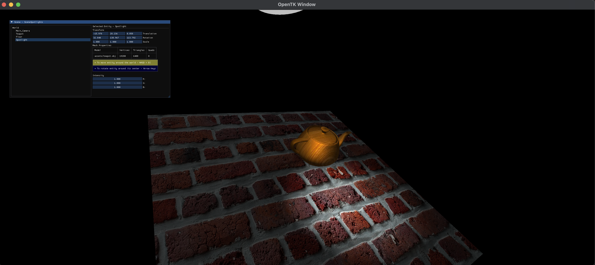

# INFOGR 2024 Practical 2 - Rasterizer

- Team members:
  - Una Garcia `7403658`
  - Vlad Puscaru `5248973`

## Formalities:

- [ ] This readme.txt
- [ ] Cleaned (no obj/bin folders)
- [ ] Demonstration scene(s) with all implemented features
- [ ] (Optional) Screenshots: make it clear which feature is demonstrated in which screenshot

## Minimum requirements implemented:

- [x] Camera: position and orientation controls
      `Controls: WASD, EC + arrow keys for rotation`
- [x] Model matrix: for each mesh, stored as part of the scene graph
- [x] Scene graph data structure: tree hierarchy, no limitation on breadth or depth or size
- [x] Rendering: recursive scene graph traversal, correct model matrix concatenation
- [x] Shading in fragment shader: diffuse, glossy, uniform variable for ambient light color
- [x] Point light: at least 1, position/color may be hardcoded

## Bonus features implemented:

- [x] Multiple point lights: at least 4, uniform variables to change position and color at runtime
      
- [x] Spot lights: position, center direction, opening angle, color
      
- [ ] Environment mapping: cube or sphere mapping, used in background and/or reflections
- [ ] Frustum culling: in C# code, using scene graph node bounds, may be conservative
- [x] Bump or normal mapping
      
- [ ] Shadow mapping: render depth map to texture, only hard shadows required, some artifacts allowed
- [ ] Vignetting and chromatic aberrations: darker corners, color channels separated more near corners
- [ ] Color grading: color cube lookup table
- [ ] Blur: separate horizontal and vertical blur passes, variable blur size
- [ ] HDR glow: HDR render target, blur in HDR, tone-mapping
- [ ] Depth of field: blur size based on distance from camera, some artifacts allowed
- [ ] Ambient occlusion: darker in tight corners, implemented as screen-space post process
- [ ] ...
# showcase.rasterizer
